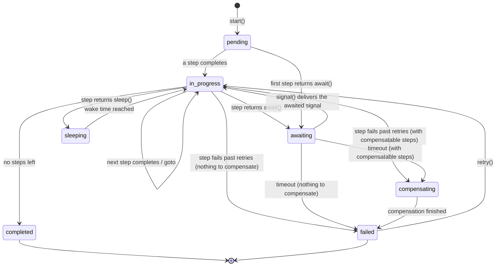

# Workflow Engine

[](https://github.com/juststeveking/workflow-engine/actions/workflows/ci.yml)
[](https://packagist.org/packages/juststeveking/workflow-engine)
[](https://packagist.org/packages/juststeveking/workflow-engine)
[](LICENSE.md)

A signal-driven, step-based workflow engine for Laravel.

Most of the interesting logic in a Laravel application is not a single request. It is a process that unfolds over hours or days, and spends most of that time waiting on something it does not control. A payment provider. A human clicking a link in an email. A cron tick three days from now.

This package lets you model those processes as an ordered sequence of steps. Each step does one thing and then tells the engine what happens next: complete, pause and wait for a named signal, sleep for a while, jump somewhere else in the sequence, or fail. Instances are persisted as database rows, driven forward by queued jobs, and resumed by signals arriving from outside. The engine takes care of state transitions, retries with backoff, timeouts, saga compensation, and the race conditions that come free with an at-least-once queue.

## What it looks like

A workflow is an ordered list of steps. A step does one thing, then tells the engine what happens next:

```php
final class MemberRegistration implements WorkflowDefinitionContract
{
    public static function name(): string
    {
        return 'member_registration';
    }

    public function steps(): array
    {
        return [ChargeCard::class, ProvisionAccount::class];
    }
}

final class ChargeCard implements WorkflowStepContract
{
    public function execute(WorkflowContext $context): StepResult
    {
        // ...charge the card through your gateway...

        return StepResult::await('payment_succeeded'); // pause until the webhook lands
    }

    public function timeoutSeconds(): ?int { return 3600; } // ...or fail if it never does
    public function maxAttempts(): int { return 1; }
}
```

Start it, and let it wait. No worker is held open, no request is blocked. The instance is a database row parked on a signal:

```php
$instance = app(WorkflowEngine::class)->start('member_registration', (string) $member->id, 'member');

// ...hours later, the payment provider calls your webhook...
$engine->signal($instance->id, 'payment_succeeded', ['payment_id' => 'pay_123']);
```

That is the whole idea. The rest of this README is detail on the pieces, and there are four complete, copy-pasteable workflows in [examples/](examples) if you would rather read code than prose.

## Why this exists

Think about what a member registration actually looks like once you write it out honestly:

> A member signs up, we charge their card, **we wait for the payment provider's webhook**, we provision their account, **we wait for them to verify their email**, and then we send a welcome pack.

Two of those five stages are waiting. Waiting is where the design falls apart.

The usual approach is to bolt a few booleans onto the model and let the flow emerge from whatever code happens to fire next. `payment_confirmed`, `account_provisioned`, `welcome_sent`. It works for a week. Then the logic ends up smeared across a controller, two listeners, a webhook handler, and a scheduled command, and nobody on the team can answer the only question that ever gets asked in support: where is this member stuck, and why?

That question is the whole reason this package exists. There is one place that describes the process, and one durable row per run that can answer it.

What you get out of that:

- **Explicit steps.** Each one is a small class with a single job, resolved from the container.
- **Pause and resume.** A step can suspend the entire workflow until a named signal arrives, without holding a worker or an HTTP request open.
- **Branch, sleep, retry, compensate.** Non-linear routing, timed delays, bounded retries with backoff, and saga-style rollback are first-class outcomes rather than things you build on top.
- **Durable, observable state.** Every instance is a row with its status, current step, accumulated context, timestamps, and failure reason. Every transition fires a domain event.
- **Swappable storage** behind a single contract.

## When to reach for it

Reach for it when there is waiting in the process, when you need to know exactly which step an instance is parked on and why it failed, or when you are about to stitch something together from listeners, scheduled jobs, and status columns.

Do not reach for it for a synchronous sequence with no waiting and no failure branching, for pure fan-out event handling (Laravel events are already good at that), or for a single background job that happens to have a few lines in it. A workflow engine earns its keep when the process is long-lived. Otherwise it is ceremony.

## The mental model

Seven nouns, and they fit on a napkin:

```
Definition  = a named, ordered list of Step classes
Step        = one unit of work that returns a StepResult
StepResult  = complete() | await('signal') | goto(Step) | sleep(seconds) | fail('reason')
Instance    = one live run of a Definition, persisted as a row
Context     = an immutable key/value bag passed step to step
Signal      = a named external event that resumes an awaiting instance
Engine      = advances instances, applies signals, times out, retries, compensates
```

The important detail is what the engine does **not** do. It never runs your whole workflow in one call. It runs exactly one step, persists the result, and queues a job for the next one if there is more to do. Awaiting and sleeping steps stop entirely until a signal arrives or the wake time passes. Nothing is held open, so a workflow that waits three days costs you a database row and nothing else.

## Installation

```bash
composer require juststeveking/workflow-engine
```

The service provider is auto-discovered and the package loads its own migrations:

```bash
php artisan migrate
```

If you want to customise the schema or the config, publish them first:

```bash
php artisan vendor:publish --tag=workflow-engine-migrations
php artisan vendor:publish --tag=workflow-engine-config
php artisan migrate
```

Two tables get created. `workflow_instances` holds one row per run. `workflow_signals` is an append-only log of every signal delivered, including buffered ones and timeouts, which is the first place I look when something has gone sideways in production.

## Configuration

`config/workflow-engine.php`:

```php
return [
    // Connection and queue the engine's jobs run on. null = application default.
    'queue' => [
        'connection' => env('WORKFLOW_ENGINE_QUEUE_CONNECTION'),
        'name' => env('WORKFLOW_ENGINE_QUEUE'),
    ],

    // Retry delay: exponential from "backoff" seconds, capped at "max_backoff".
    // 0 = immediate retries. A step can override this via HasRetryBackoff.
    'retry' => [
        'backoff' => (int) env('WORKFLOW_ENGINE_RETRY_BACKOFF', 5),
        'max_backoff' => (int) env('WORKFLOW_ENGINE_RETRY_MAX_BACKOFF', 300),
    ],

    // Consume a signal delivered before its step is awaiting, instead of throwing.
    // Prevents lost webhooks from a fast provider.
    'signals' => [
        'buffer_early' => (bool) env('WORKFLOW_ENGINE_BUFFER_EARLY_SIGNALS', true),
    ],
];
```

Worth giving the engine its own queue connection in production. Workflow advance jobs are small and frequent, and you do not want them stuck behind a slow image resize.

## Quickstart

### 1. Define your steps and a workflow

```php
use JustSteveKing\WorkflowEngine\Contracts\WorkflowDefinitionContract;
use JustSteveKing\WorkflowEngine\Contracts\WorkflowStepContract;
use JustSteveKing\WorkflowEngine\Domain\StepResult;
use JustSteveKing\WorkflowEngine\Domain\WorkflowContext;

final class ChargeMemberStep implements WorkflowStepContract
{
    public function execute(WorkflowContext $context): StepResult
    {
        $payment = Payments::charge($context->get('member_id'), $context->get('plan'));

        // Pause here until the provider confirms the charge via webhook.
        return StepResult::await('payment_succeeded', ['payment_ref' => $payment->ref]);
    }

    public function timeoutSeconds(): ?int { return 3600; } // fail if no signal within an hour
    public function maxAttempts(): int { return 1; }        // charging twice is worse than failing
}

final class ProvisionAccountStep implements WorkflowStepContract
{
    public function execute(WorkflowContext $context): StepResult
    {
        Accounts::provision($context->get('member_id'), $context->get('payment_id'));

        return StepResult::complete();
    }

    public function timeoutSeconds(): ?int { return null; }
    public function maxAttempts(): int { return 3; }
}

final class MemberRegistrationWorkflow implements WorkflowDefinitionContract
{
    public static function name(): string { return 'member_registration'; }

    public function steps(): array
    {
        return [ChargeMemberStep::class, ProvisionAccountStep::class];
    }
}
```

Read the two `maxAttempts()` values back to back and you can see the design decision in each step. Charging a card is not safe to repeat, so it gets one attempt. Provisioning an account is idempotent on our side, so it gets three. That choice belongs next to the code that makes it, which is why it lives on the step rather than in a config file.

### 2. Register the workflow

Typically in a service provider's `boot()`:

```php
use JustSteveKing\WorkflowEngine\Domain\WorkflowRegistry;

$this->app->make(WorkflowRegistry::class)->register(MemberRegistrationWorkflow::class);
```

### 3. Start an instance and drive it

```php
use JustSteveKing\WorkflowEngine\Domain\WorkflowEngine;

$engine = app(WorkflowEngine::class);

$instance = $engine->start(
    workflowName: 'member_registration',
    aggregateId: (string) $member->id,
    aggregateType: 'member',
    initialContext: ['member_id' => $member->id, 'plan' => 'annual'],
);

$engine->advance($instance->id); // in production the queued job does this for you
```

### 4. Resume it when the signal arrives

```php
$engine->signal(
    instanceId: $instance->id,
    signal: 'payment_succeeded',
    signalData: ['payment_id' => 'pay_123'],
    deliveredBy: 'stripe_webhook',
);
```

That is the entire loop. Everything below is detail on the pieces.

## Core concepts

| Concept | Type | Responsibility |
|---|---|---|
| **Definition** | `WorkflowDefinitionContract` | A `name()` and an ordered `steps()`. Optionally `VersionedWorkflowDefinition`. |
| **Step** | `WorkflowStepContract` | `execute()`, `timeoutSeconds()`, `maxAttempts()`. Optionally `CompensatingStep`, `HasRetryBackoff`. |
| **StepResult** | `Domain\StepResult` | `complete`, `await`, `goto`, `sleep`, or `fail`. |
| **WorkflowContext** | `Domain\WorkflowContext` | Immutable key/value data carried between steps. |
| **WorkflowEngine** | `Domain\WorkflowEngine` | `start`, `advance`, `signal`, `timeout`, `retry`, `compensate`. |
| **WorkflowRegistry** | `Domain\WorkflowRegistry` | Maps a workflow name to its definition class. |
| **WorkflowInstance** | `Domain\WorkflowInstance` | The state of one run, hydrated from the database and read-only from outside. |

### The aggregate

Every instance is tied to an aggregate, meaning the domain entity the process is actually *about*, through `aggregateId` and `aggregateType`. Something like `'42'` and `'member'`.

This looks like bookkeeping until the first webhook lands. A payment provider tells you a charge succeeded for customer 42. It has no idea your workflow instance is `01J...`. The aggregate is what lets you ask "which workflows for this member are waiting on `payment_succeeded`?" without having stashed an instance ID somewhere first.

## The instance lifecycle



- **pending**: created, no step has run yet.
- **in_progress**: a step ran and advanced, the next one is queued.
- **awaiting**: parked on a named signal.
- **sleeping**: parked until a wake time, then the next step runs.
- **compensating**: a failure triggered saga rollback and compensations are running.
- **completed**: all steps done. Terminal.
- **failed**: failed past retries, threw, or timed out, after any compensation. `retry()` can re-arm it, and `failed_reason` tells you why it got there.

### The lifecycle is enforced, not documented

This is the part I care most about. That diagram is not a picture of what the code hopefully does. It is a declarative, enforced state machine built on [`juststeveking/state-machine`](https://github.com/juststeveking/state-machine).

Every transition in the diagram is a `TransitionContract` in `src/StateMachine/Transitions`, and every status change an instance makes goes through `StateMachine::transition()`. An illegal move, such as completing a failed instance or awaiting from a terminal state, throws `JustSteveKing\StateMachine\Exceptions\InvalidTransitionException`. No code path can put an instance into an impossible state, including a custom repository or direct use of the domain object.

`Domain\WorkflowStatus` is the machine's `StateContract` and `StateMachine\WorkflowStateMachine` is the adapter.

I have debugged enough half-finished processes to know that "how did this row get into this state" is a question you never want to be asking at 2am. The state machine means you cannot be.

## Defining steps

```php
interface WorkflowStepContract
{
    public function execute(WorkflowContext $context): StepResult;
    public function timeoutSeconds(): ?int; // seconds to await a signal, or null
    public function maxAttempts(): int;     // total attempts before failing, 1 = no retry
}
```

Steps are resolved from the container, so constructor dependencies are injected as you would expect. Two optional interfaces add behaviour:

- `HasRetryBackoff` gives you `retryBackoff(int $attempt): int` to override the configured backoff.
- `CompensatingStep` gives you `compensate(WorkflowContext $context): void` to undo the step during saga rollback.

Keep steps small, and keep them idempotent where you can. Under an at-least-once queue, a step can run more than once in rare failure windows. That is a property of the queue, not a bug in the engine, and no amount of locking removes it entirely.

## Step outcomes with StepResult

```php
StepResult::complete(['payment_id' => $id]);   // advance to the next step
StepResult::await('payment_succeeded', [...]); // pause for a named signal
StepResult::goto(RefundStep::class, [...]);    // jump to another step in the sequence
StepResult::sleep(3600, [...]);                // advance, but only after a delay
StepResult::fail('Card declined');             // fail the step, subject to maxAttempts
```

Each of them takes optional context updates to merge in.

If `execute()` throws instead of returning, the engine treats it as a failure using the exception message and applies exactly the same retry and compensation logic. An instance never gets stranded halfway through a step because someone forgot a try/catch.

## The workflow context

`WorkflowContext` is an immutable bag threaded through the workflow. You read from it inside a step and return updates through the `StepResult`. There is no setter, which is deliberate: if a step could mutate context in place, the persisted row and the in-memory object would drift apart the moment something threw.

```php
$context->get('plan');            // value or null
$context->get('plan', 'monthly'); // value or default
$context->has('payment_id');      // bool
$context->all();                  // array<string, mixed>
```

It accumulates the `initialContext`, every set of `contextUpdates`, and the data from every signal, and it is persisted as JSON. Keep it to serialisable values such as IDs, scalars, and small arrays rather than whole models. A model you serialised on Tuesday is a lie by Thursday.

## Branching with goto

Return `StepResult::goto(SomeStep::class)` to jump to another step in the workflow's sequence instead of advancing linearly. The target has to be one of the definition's steps, which keeps the graph closed and inspectable:

```php
public function execute(WorkflowContext $context): StepResult
{
    return $context->get('amount') > 10_000
        ? StepResult::goto(ManualReviewStep::class)
        : StepResult::complete();
}
```

## Delaying with sleep

Return `StepResult::sleep($seconds)` when you want to advance to the next step, but not yet. This is your "wait three days, then send a reminder":

```php
return StepResult::sleep(now()->diffInSeconds(now()->addDays(3)), ['reminded_at' => now()]);
```

The instance moves to **sleeping** and a delayed advance is queued. A stray advance that arrives before the wake time is ignored rather than skipping the delay.

## Awaiting signals

When a step returns `await('some_signal')`, the instance parks in **awaiting** until you call `signal()` with a matching name:

```php
$engine->signal(
    instanceId: $instance->id,
    signal: 'payment_succeeded',             // must match what the step is awaiting
    signalData: ['payment_id' => 'pay_123'], // merged into the context
    deliveredBy: 'stripe_webhook',           // free-form provenance label, logged
);
```

Every delivery is written to `workflow_signals`, matched or not. On a match, the data is merged into the context and the workflow advances.

## Early signal buffering

Here is a race you will hit eventually. Your step calls the payment provider and returns `await('payment_succeeded')`. The provider is fast. The webhook lands before the engine has finished persisting the parked state, the signal finds an instance that is not awaiting anything yet, and it is gone.

With `signals.buffer_early` on, which is the default, a signal delivered to an instance that is not yet awaiting it gets buffered instead of throwing. When a step later awaits that signal, the buffered one is consumed immediately and the workflow advances without ever parking. When an instance reaches a terminal state, any still-unconsumed buffered signals are discarded, so a mistyped or never-awaited signal name does not accumulate forever — though it will not raise either, so watch the `SignalReceived` `buffered` flag if you want to catch delivery typos.

Turn it off and a mismatched `signal()` throws `InvalidSignalException` instead. That is the right choice if a stray signal genuinely means something has gone wrong upstream and you would rather find out loudly.

## Timeouts

An awaiting step can bound its wait by returning a non-null `timeoutSeconds()`. The engine schedules a delayed `TimeoutWorkflowStep` job tagged with the step it guards. If the signal has not arrived by then, the instance fails, or compensates if there is anything to compensate.

The tagging matters more than it sounds. Without it, a timeout scheduled an hour ago for a step that has long since completed would fire and kill whatever step the workflow is on now. Because the job knows which step it was guarding, a stale timeout is simply ignored.

Return `null` to wait indefinitely.

## Retries and backoff

`maxAttempts()` is the total number of attempts for a step before it fails, not the number of retries on top of the first run:

- `1` means no retry. The first failure fails the step.
- `3` means up to three runs. Each failure short of the limit re-queues the step.

Retries are delayed by an exponential backoff derived from config, growing from `retry.backoff` and capped at `retry.max_backoff`, unless the step implements `HasRetryBackoff::retryBackoff($attempt)` and decides for itself.

The attempt counter is persisted per instance and reset when the step advances, so every step gets a fresh budget rather than inheriting the scars of the one before it.

## Failure, compensation, and resume

When a step fails past its retries, throws, or times out, one of two things happens.

If any already-completed step implements `CompensatingStep`, the instance moves to **compensating** and a `CompensateWorkflow` job runs each of those steps' `compensate()` methods in reverse order before marking the instance **failed**. That is saga-style rollback: you cannot roll back a distributed transaction, so you run the inverse operations instead. A `compensate()` that throws does not abort the rollback — the engine dispatches a `StepCompensationFailed` event for that step and carries on with the rest, so a refund that bounces is visible rather than silent.

Otherwise the instance goes straight to **failed**.

```php
final class ChargeStep implements WorkflowStepContract, CompensatingStep
{
    public function execute(WorkflowContext $context): StepResult { /* charge */ }
    public function compensate(WorkflowContext $context): void { /* refund */ }
    // ...
}
```

A failed instance is terminal but recoverable. `retry()` re-arms it at the step that failed and queues an advance:

```php
$engine->retry($instance->id); // back to in_progress, failure cleared
```

> Compensation callbacks run **outside** the database transaction and row lock. The engine captures the compensation plan under a short lock, runs your `compensate()` methods unlocked (so a slow external refund does not hold a DB connection or block other jobs on the instance), then records the terminal failure under a second short lock. `compensate()` should still be idempotent: an at-least-once queue can redeliver the compensate job, so guard external calls with an idempotency key.

## Definition versioning

At `start()`, the engine snapshots the definition's ordered step list onto the instance along with a version number.

This is the thing that makes the package safe to deploy. In-flight instances keep running against their snapshot even if you edit `steps()` afterwards, so a Tuesday deploy that inserts a step in the middle of a workflow does not corrupt the two hundred instances currently parked on a webhook. They finish on the shape they started with. New instances get the new shape.

Implement `VersionedWorkflowDefinition` to record an explicit `version()`, which defaults to `1`. It is stored on the instance and carried through for auditing.

## Events

Every transition dispatches a domain event from `JustSteveKing\WorkflowEngine\Events`, fired after the database transaction commits. Listen for logging, metrics, notifications, or a dashboard.

| Event | Fired when |
|---|---|
| `WorkflowStarted` | An instance is created. |
| `StepCompleted` | A step advanced through complete, goto, sleep, or signal. |
| `StepFailed` | A step failed. `willRetry` tells you whether a retry follows. |
| `WorkflowAwaitingSignal` | A step parked on a signal. |
| `SignalReceived` | A signal was delivered. `buffered` tells you whether it was queued for later. |
| `StepTimedOut` | An awaiting step timed out. |
| `WorkflowSlept` | A step began sleeping, with `wakeAt`. |
| `WorkflowCompleted` | The workflow finished. |
| `WorkflowCompensating` | Saga rollback began. |
| `StepCompensationFailed` | A step's `compensate()` threw during rollback. |
| `WorkflowFailed` | The workflow failed, after any compensation. |
| `WorkflowRetried` | A failed instance was re-armed. |

If you build one dashboard off this package, build it off these events. They give you time-to-completion, stuck instance counts by step, and signal latency without touching the engine.

## Driving workflows with the queue

`advance`, `timeout`, and `compensate` are normally invoked by the bundled queued jobs, `AdvanceWorkflow`, `TimeoutWorkflowStep`, and `CompensateWorkflow`, which the engine dispatches as instances progress. So you need a worker:

```bash
php artisan queue:work
```

Queue dispatches are deferred until the surrounding database transaction commits, which means a follow-on job can never observe state the engine has not persisted yet. In a synchronous context you can still call the engine methods directly, which is exactly what the test suite does.

## Delivering signals from webhooks

This is where the aggregate pays off:

```php
public function handleStripeWebhook(
    Request $request,
    WorkflowEngine $engine,
    WorkflowRepositoryContract $repo,
): Response {
    $event = /* verify and parse */;

    $awaiting = $repo->findAwaitingSignal(
        signal: 'payment_succeeded',
        aggregateId: $event->metadata['member_id'],
        aggregateType: 'member',
    );

    foreach ($awaiting as $instance) {
        $engine->signal($instance->id, 'payment_succeeded', ['payment_id' => $event->id], 'stripe_webhook');
    }

    return response()->noContent();
}
```

No instance IDs stored on the payment provider's side, no correlation table. You ask which instances for this member are waiting on this signal, and you tell them.

With early signal buffering on, you can also deliver a `signal()` to an instance that has not parked yet and trust it to be consumed when the step gets there.

## Console commands

The package ships a set of artisan commands for development and operations:

| Command | What it does |
|---|---|
| `workflow:list` | List the registered workflow definitions with their step counts and versions. |
| `workflow:show {id}` | Inspect one instance: status, cursor position in the step sequence, context, timestamps, and its signal log (buffered rows are flagged). This is the "where is it stuck and why" view. |
| `workflow:instances [--status= --workflow= --aggregate= --limit=]` | List instances with a filter, plus a per-status summary. |
| `workflow:start {workflow} {aggregateId} {aggregateType} [--context=JSON]` | Start an instance from the CLI. |
| `workflow:signal {id} {signal} [--data=JSON] [--by=]` | Deliver a signal by hand — resume a flow locally, or recover a missed webhook. |
| `workflow:advance {id}` | Advance one step synchronously, handy when you have no worker running locally. |
| `workflow:retry {id?} [--workflow= --failed-since= --force]` | Re-arm a failed instance, or a batch of them (`--workflow` / `--failed-since`). |
| `workflow:tick [--limit=]` | Re-dispatch advance jobs for sleeping instances past their wake time. |
| `workflow:prune [--days=30 --status=completed,failed --force]` | Delete old terminal instances; their signals cascade. |

**`workflow:tick` is the one to wire into the scheduler.** Sleeping instances resume via a *delayed* queue job, and delayed jobs can be lost — a queue restart, a flushed Redis. `tick` is the safety net: it finds sleepers whose `wake_at` has passed and re-queues their advance, so a lost timer self-heals. Run it every minute:

```php
// routes/console.php (Laravel 11+)
use Illuminate\Support\Facades\Schedule;

Schedule::command('workflow:tick')->everyMinute();
Schedule::command('workflow:prune')->daily();
```

`instances`, `tick`, and `prune` query the bundled Eloquent tables directly; the rest go through the engine and registry and work with any repository.

## Concurrency guarantees

The engine assumes an at-least-once queue where duplicate and out-of-order jobs are normal rather than exceptional:

- **Row locking.** `advance`, `signal`, `timeout`, `retry`, and `compensate` each run inside a transaction and load the instance with `SELECT ... FOR UPDATE`. Two concurrent advance jobs cannot both execute the same step.
- **Stale job guards.** Advance no-ops on terminal or awaiting instances, and on a sleeping instance before its wake time. Timeout no-ops unless the instance is still awaiting the exact step the job was scheduled for. Compensate no-ops unless the instance is compensating.
- **Deferred dispatch.** Follow-on jobs and events fire only after commit.

Read that as narrowing the window for double execution rather than closing it. Nothing here makes your steps idempotent for you. If a step has side effects, design it to tolerate a rare re-run.

## Custom persistence

The engine only ever talks to storage through `WorkflowRepositoryContract`, so swapping the default `EloquentWorkflowRepository` is a one-liner in a service provider:

```php
$this->app->bind(WorkflowRepositoryContract::class, MyRepository::class);
```

Your implementation has to honour the contract's transactional intent, and this is not optional. `transaction()` runs a callback atomically. `findById($id, lock: true)` takes a genuine row lock within it. `pullBufferedSignal()` atomically consumes a buffered signal, and `discardBufferedSignals()` clears the ones an instance can no longer consume. Every guarantee in the section above rests on those, so a repository that quietly no-ops the locking will look fine in development and lose you money in production.

## Exceptions

| Exception | Thrown when |
|---|---|
| `WorkflowNotFoundException` | An engine call is given an unknown instance ID. |
| `InvalidSignalException` | `signal()` targets a non-awaiting or mismatched instance while buffering is off, or the instance is terminal. |
| `InvalidArgumentException` | `start()` names an unregistered workflow. |
| `InvalidTransitionException` | The state machine rejected an illegal status change, from `JustSteveKing\StateMachine\Exceptions`. This one means a bug. Legal flows never trigger it. |
| `RuntimeException` | A definition or step does not implement its contract, an `await` omits its signal, a `goto` targets a step outside the sequence, or `retry()` was called on an instance that has not failed. |

## Examples

The [examples/](examples) directory has four complete workflows, each written to show off one part of the engine. They are illustrative — the payment and mail calls are left as comments — so you can read the shape without wiring up real services:

- [`MemberRegistration`](examples/MemberRegistration.php) — awaiting signals, per-step timeouts, context threaded across steps.
- [`OrderFulfilment`](examples/OrderFulfilment.php) — saga compensation with `CompensatingStep`, plus a step-defined retry backoff.
- [`ExpenseApproval`](examples/ExpenseApproval.php) — branching with `goto`, small expenses auto-approve and large ones wait for a human.
- [`AbandonedCartReminder`](examples/AbandonedCartReminder.php) — a multi-day drip campaign built on `sleep()` that costs one database row while it waits.

## Testing

```bash
composer test           # Pest test suite (Unit + Feature)
composer test:coverage  # with a coverage report (needs pcov or xdebug)
composer stan           # PHPStan / Larastan static analysis
composer lint           # Pint code style
```

The suite is split into a `Unit` testsuite for the pure value objects (`StepResult`, `WorkflowContext`, `WorkflowRegistry`, `WorkflowStatus`) and a `Feature` testsuite for everything that touches the engine, repository, state machine, events, and console commands — covering both the happy paths and the failure paths (unknown instances, unregistered workflows, invalid gotos, rejected signals, compensation failures).

When you are testing application code that drives the engine, `Queue::fake()` lets you assert the jobs were dispatched and then drive the steps manually, and `Event::fake()` lets you assert on the domain events. The package's own feature tests are the reference for both patterns, and I would start there rather than from scratch.

## Requirements

- PHP `^8.5`
- Laravel 13
- [`juststeveking/state-machine`](https://github.com/juststeveking/state-machine), installed as a dependency
- A configured queue and a running worker for production use
- A database supporting transactions and row locking, which is any standard Laravel SQL driver

## License

MIT. See [LICENSE.md](LICENSE.md).
