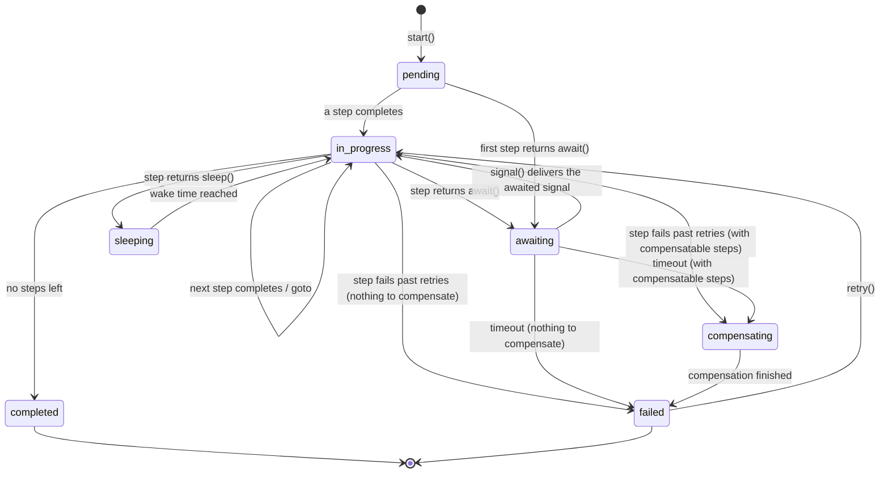

# The state machine

Every workflow instance moves through a fixed set of statuses, and the moves between them are enforced in code rather than left to convention. This is the part of the package I care most about, so it comes first.

## The instance lifecycle

- **pending**: created, no step has run yet.
- **in_progress**: a step ran and advanced, the next one is queued.
- **awaiting**: parked on a named signal.
- **sleeping**: parked until a wake time, then the next step runs.
- **compensating**: a failure triggered saga rollback and compensations are running.
- **completed**: all steps done. Terminal.
- **failed**: failed past retries, threw, or timed out, after any compensation. `retry()` can re-arm it, and `failed_reason` tells you why it got there.

## The lifecycle is enforced, not documented

That diagram is not a picture of what the code hopefully does. It is a declarative, enforced state machine that ships inside the package under `src/StateMachine`.

Every transition in the diagram is a `TransitionContract` in `src/StateMachine/Transitions`, and every status change an instance makes goes through `StateMachine::transition()`. An illegal move, such as completing a failed instance or awaiting from a terminal state, throws `JustSteveKing\WorkflowEngine\StateMachine\Exceptions\InvalidTransitionException`. No code path can put an instance into an impossible state, including a custom repository or direct use of the domain object.

`Domain\WorkflowStatus` is the machine's `StateContract` and `StateMachine\WorkflowStateMachine` is the adapter.

I have debugged enough half-finished processes to know that "how did this row get into this state" is a question you never want to be asking at 2am. The state machine means you cannot be.

## Related

- [Concurrency guarantees](concurrency.md), the locking that protects transitions under an at-least-once queue.
- [Failure and compensation](failure-and-compensation.md), the `compensating` and `failed` paths in detail.
- [Concepts](concepts.md), where the state machine sits among the other moving parts.
